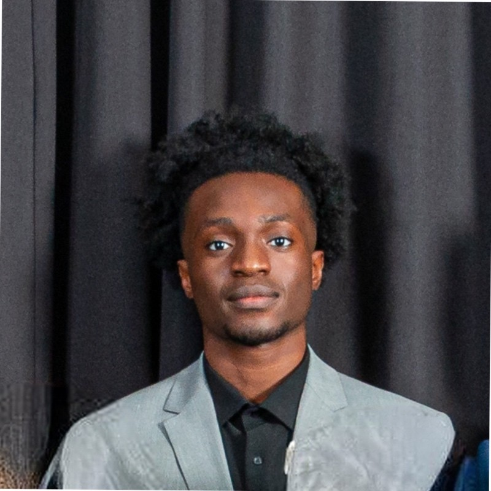

<!--
**jonathanduc/jonathanduc** is a ✨ _special_ ✨ repository because its `README.md` (this file) appears on your GitHub profile.

Here are some ideas to get you started:

- 🔭 I’m currently working on ...
- 🌱 I’m currently learning ...
- 👯 I’m looking to collaborate on ...
- 🤔 I’m looking for help with ...
- 💬 Ask me about ...
- 📫 How to reach me: ...
- 😄 Pronouns: ...
- ⚡ Fun fact: ...
-->

# Jonathan Duckes

## Bienvenue sur mon GitHub !👋

Je m'appelle Jonathan Duckes, étudiant en Master MIASHS spécialisé en Data Science, Machine Learning et Statistiques. Passionné par l'intelligence artificielle et le développement logiciel, j'aime construire des solutions innovantes et explorer de nouvelles technologies.

---

## Welcome to my GitHub! 👋

My name is Jonathan Duckes, a Master MIASHS student specializing in Data Science, Machine Learning, and Statistics. Passionate about artificial intelligence and software development, I enjoy building innovative solutions and exploring new technologies.

---

## 📚 Éducation / Education

- **Master MIASHS** (2023-)
  - Spécialisation : Data Science, Machine Learning, Statistiques
  - Université : [Université Paul Valéry Montpellier 3]

- **Licence en Mathématiques Appliquées** (2020-2023)
  - Université : [Université Paul Valéry Montpellier 3]

<!--
## 💼 Expérience / Experience

- **Stagiaire Data Scientist** chez [Nom de l'entreprise] (Date)
  - Missions : Analyse des données, Modélisation statistique, Développement d'algorithmes de Machine Learning
-->

## 🛠️ Compétences / Skills

- **Langages de programmation :** Python, R, Java, JavaScript, HTML, CSS
- **Outils et bibliothèques :** TensorFlow, Keras, PyTorch, Scikit-Learn, Pandas, NumPy, Matplotlib
- **Autres compétences :** Analyse de données, Visualisation de données, Apprentissage supervisé et non supervisé

## 📈 Statistiques GitHub / GitHub Stats

## 🌟 Projets / Projects

### [Cyclers](https://github.com/houriasayah/Cyclers)
Projet Erasmus + 3CS "Cycling, Campus & City" avec la start-up Muv. Ce projet vise à encourager la mobilité douce sur les campus universitaires.

### [Spaceship Titanic]
Projet de compétition Kaggle sur la prédiction de passagers transportés à l'aide de modèles d'apprentissage statistique.

### [Tweets Controverses](https://github.com/alyasltd/TER-2023-2024-Visualisations_de_tweets_controverses)
Travaux d'études et de recherches avec le LIRMM et Janssen Horizon. Analyse de tweets controversés autour de la santé.

### [Reconnaissance d’objets géométriques]
Projet de fin de licence de reconnaissance d'objets géométriques à l'aide du modèle d'apprentissage profond Yolo.

## 📫 Contact

- **LinkedIn :** [Jonathan Duckes](https://www.linkedin.com/in/jonathan-duckes)
- **Email :** [jonathan.duckes@outlook.fr]

